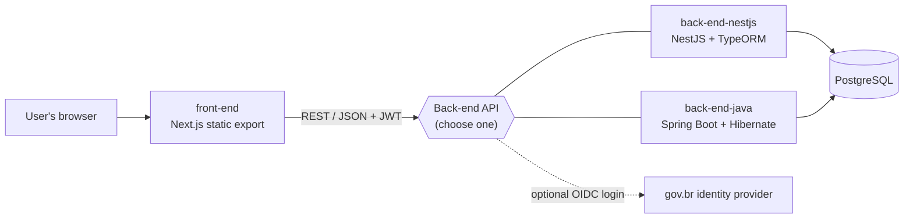

# AIE – Framework for Ethical Impact Self-Assessment in AI for the Public Sector

*[Leia em português](README.pt-br.md)*

**AIE** is an open-source platform that lets public-sector teams run a structured **ethical impact self-assessment** of AI projects. Teams register a project, answer a dynamic questionnaire organised in sessions (including an initial triage that routes the project to the appropriate level of scrutiny), and receive a final classification with scores per session.

The platform is developed by the Brazilian **Ministério da Gestão e da Inovação em Serviços Públicos (MGI)**.

- License: [GNU GPL v3.0](LICENSE)
- Privacy notice: [PRIVACY.md](PRIVACY.md)
- Code of Conduct: [CODE_OF_CONDUCT.md](CODE_OF_CONDUCT.md)
- Contributing: [CONTRIBUTING.md](CONTRIBUTING.md)
- Security policy: [SECURITY.md](SECURITY.md)

---

## Architecture

The repository is a monorepo with a web front-end, two interchangeable back-end implementations and a PostgreSQL database. Only **one** back-end is deployed at a time; both expose the same REST API.



| Component | Stack | Description | Docs |
|-----------|-------|-------------|------|
| [`front-end/`](front-end) | Next.js 14, React 18, TailwindCSS | Administrative and questionnaire UI. Built as a **static export** that can be served by any web server. | [front-end/README.md](front-end/README.md) |
| [`back-end-nestjs/`](back-end-nestjs) | NestJS 11, TypeORM, PostgreSQL | Reference REST API: business rules, authentication, persistence and audit logs. | [back-end-nestjs/README.md](back-end-nestjs/README.md) |
| [`back-end-java/`](back-end-java) | Spring Boot 3, Hibernate, PostgreSQL | Equivalent REST API in Java, for organisations that standardise on the JVM. | [back-end-java/README.md](back-end-java/README.md) |

All components are fully self-hostable and depend only on open-source software. No proprietary cloud service is required.

### Authentication

- **Administrators**: e-mail/password login (`POST /auth/login`) returning a JWT.
- **gov.br (optional)**: OpenID Connect login through the Brazilian federal identity provider (`GET /govbr/authorize` → `GET /govbr/callback`). It is enabled only when the `GOVBR_*` variables are set; deployments outside Brazil can leave it disabled or replace it with another OIDC provider.

---

## Quick start (Docker Compose)

Requirements: Docker with Compose v2 and a reachable PostgreSQL 13+ instance.

```bash
# 1. Create an environment file from the example
cp back-end-nestjs/.env.example .env.local
# edit .env.local: database credentials, JWT_SECRET, optional GOVBR_* values

# 2. Start front-end + back-end (choose nest or java, dev or prod)
LOCAL_ENV_FILE=.env.local docker compose -f docker-compose.nest-dev.yml up
```

Available compose files: `docker-compose.nest-dev.yml`, `docker-compose.nest-prod.yml`, `docker-compose.java-dev.yml`, `docker-compose.java-prod.yml`.

- Front-end: <http://localhost:3000>
- API: <http://localhost:8080>
- API documentation: see [Data extraction & interoperability](#data-extraction--interoperability)

Database migrations run automatically when the NestJS back-end starts (`migrationsRun: true`); they create the schema, the default actors and classification levels. Sessions and questions are then managed by administrators through the UI or the API.

To run each component without Docker, follow the component READMEs.

---

## Configuration

All configuration is done through environment variables. Example files: [`back-end-nestjs/.env.example`](back-end-nestjs/.env.example), [`back-end-java/.env.example`](back-end-java/.env.example), [`front-end/.env.example`](front-end/.env.example).

### Back-end (NestJS and Java)

| Variable | Required | Default | Description |
|----------|----------|---------|-------------|
| `POSTGRES_HOST` | yes | `localhost` | PostgreSQL host |
| `POSTGRES_PORT` | no | `5432` | PostgreSQL port |
| `POSTGRES_USER` | yes | — | Database user |
| `POSTGRES_PASSWORD` | yes | — | Database password |
| `POSTGRES_DB` | yes | — | Database name |
| `JWT_SECRET` | **yes** | — | Secret used to sign JWT access tokens. Use a long random value. |
| `NODE_ENV` | no | — | `development` enables TypeORM schema sync and SQL logging (NestJS only) |
| `PORT` | no | `8080` | HTTP port (NestJS) |
| `SERVER_PORT` | no | `8080` | HTTP port (Java) |
| `JWT_ACCESS_EXPIRES_IN` | no | `1h` | Access token lifetime (Java) |
| `JWT_REFRESH_EXPIRES_IN` | no | `7d` | Refresh token lifetime (Java) |

### gov.br login (optional)

| Variable | Default | Description |
|----------|---------|-------------|
| `GOVBR_CLIENT_ID` | — | OIDC client id issued by gov.br. Login is disabled if unset. |
| `GOVBR_CLIENT_SECRET` | — | OIDC client secret |
| `GOVBR_BASE_URL` | `https://sso.acesso.gov.br` | Base URL of the authorisation server |
| `GOVBR_API_BASE_URL` | `https://api.acesso.gov.br` | Base URL used to build the userinfo endpoint |
| `GOVBR_AUTH_URL` | `${GOVBR_BASE_URL}/authorize` | Overrides the authorisation endpoint |
| `GOVBR_TOKEN_URL` | `${GOVBR_BASE_URL}/token` | Overrides the token endpoint |
| `GOVBR_USERINFO_URL` | `${GOVBR_API_BASE_URL}/userinfo` | Overrides the userinfo endpoint |
| `GOVBR_REDIRECT_URI` | `http://localhost:8080/retornoWebHook` | Redirect URI registered with gov.br |
| `GOVBR_FRONTEND_ORIGIN` | `http://localhost:3000` | Front-end origin that receives the token via `postMessage` |
| `GOVBR_SCOPE` | `openid email profile` | Requested scopes |
| `GOVBR_BASIC_AUTH` | — | Pre-computed `Basic` credentials for the token endpoint (optional) |
| `GOVBR_STATE_SECRET` | `JWT_SECRET` | Secret used to sign the OAuth `state` parameter |

### Front-end

| Variable | Default | Description |
|----------|---------|-------------|
| `NEXT_PUBLIC_API_URL` | `http://localhost:8080/` | Base URL of the back-end API (with trailing slash). Embedded at build time. |

---

## Data flow

1. **Sessions** are registered with `is_triage`, `next_session_code` and, for triage sessions, a `triage_config` describing thresholds and the next form.
2. **Questions** belong to a session and carry JSON options (with `points`, `score` or `score_positive`).
3. While a project is being assessed (front-end `responses/page.tsx`), each session is submitted via `POST /responses`. Triage risk is computed client-side and sent as `session_scores` metadata.
4. When `next_session_code = RESULT` is reached, the answers are saved, a result summary is generated and persisted via `POST /results`, and `responses.status` becomes `FINISHED`.
5. The **Projects** and **Received submissions** screens list only `FINISHED` responses, reading `response.result.summary` to display the level and score.

### Main database entities

| Entity | Description |
|--------|-------------|
| `administradores` | Administrator accounts |
| `projects` / `project_shared_users` | Assessed projects and the people (by CPF) they are shared with |
| `sessions` / `questions` / `questions_versions` | Questionnaire structure (sessions, triage, questions, options) and question history |
| `actors` | Actors that can be linked to questions |
| `responses` / `response_answers` | Submissions per project and individual answers |
| `results` | Final summary (level, score, sections) |
| `classification_levels` | Configurable classification levels and thresholds |
| `logs` | Audit log of user actions |

See [PRIVACY.md](PRIVACY.md) for what personal data is processed and how.

---

## Data extraction & interoperability

AIE stores all its data in a standard PostgreSQL database and exposes it through a documented **REST API that exchanges JSON** (`application/json`). Both back-ends publish an **OpenAPI 3** specification:

| Back-end | Interactive docs (Swagger UI) | OpenAPI spec (JSON) |
|----------|-------------------------------|---------------------|
| NestJS | `http://<host>:8080/api/docs` | `http://<host>:8080/api/docs-json` |
| Java | `http://<host>:8080/docs` | `http://<host>:8080/api-docs` |

The documentation endpoints are public; data endpoints require a JWT (`Authorization: Bearer <token>`) obtained from `POST /auth/login` or the gov.br flow.

Useful endpoints for extracting data:

| Endpoint | Content | Personal data |
|----------|---------|---------------|
| `GET /dashboard` | Aggregated indicators: totals of projects and responses, responses by status, average score per session, most frequent answer per question | No (aggregated) |
| `GET /sessions`, `GET /questions`, `GET /classification-levels`, `GET /actors` | The assessment instrument itself (sessions, questions, options, thresholds) | No |
| `GET /projects`, `GET /responses`, `GET /results/{responseId}` | Individual projects, submissions and results | **Yes** – includes the project owner and shared users; access is restricted to authenticated users |

Because the data lives in PostgreSQL, operators can also export it with standard tools (`pg_dump`, `COPY ... TO ... CSV`).

In the user interface, the final result screen can be exported through the browser's print dialog (e.g. *Save as PDF*).

---

## Internationalisation

The user interface is available in **Portuguese, English, Spanish and French** (`front-end/src/service/languages/{pt,en,es,fr}.ts`), selectable from the header. The questionnaire content (sessions and questions) is stored in the database and can be translated by each deploying organisation.

---

## Useful scripts

```bash
# front-end
npm run dev      # development server
npm run build    # static export to ./out
npm run lint

# back-end-nestjs
npm run start:dev
npm run build
npm run start:prod
npm test

# back-end-java
mvn spring-boot:run
mvn clean package
```

---

## Contributing & support

Contributions are welcome — please read [CONTRIBUTING.md](CONTRIBUTING.md) and follow the [Code of Conduct](CODE_OF_CONDUCT.md). Report bugs and request features through the [issue tracker](https://github.com/gestaogovbr/etica-ia-governanca/issues). Security issues must be reported privately as described in [SECURITY.md](SECURITY.md).

Institutional contact: **cggia@gestao.gov.br** (Secretaria de Governo Digital – MGI).

## License

Copyright © 2026 Ministério da Gestão e da Inovação em Serviços Públicos (MGI).

This program is free software: you can redistribute it and/or modify it under the terms of the **GNU General Public License version 3** as published by the Free Software Foundation. See [LICENSE](LICENSE) for the full text.
