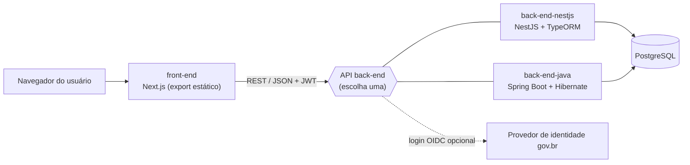

# AIE – Framework de Autoavaliação de Impacto Ético em IA para o Setor Público

*[Read in English](README.md)*

O **AIE** (*Framework for Ethical Impact Self-Assessment in AI for the Public Sector*) é uma plataforma de código aberto que permite a equipes do setor público realizar uma **autoavaliação estruturada do impacto ético** de projetos de IA. As equipes cadastram um projeto, respondem a um questionário dinâmico organizado em sessões (incluindo uma triagem inicial que direciona o projeto ao nível de análise adequado) e recebem uma classificação final com pontuação por sessão.

A plataforma é desenvolvida pelo **Ministério da Gestão e da Inovação em Serviços Públicos (MGI)**.

- Licença: [GNU GPL v3.0](LICENSE)
- Aviso de privacidade: [PRIVACY.md](PRIVACY.md) (em inglês)
- Código de Conduta: [CODE_OF_CONDUCT.md](CODE_OF_CONDUCT.md)
- Como contribuir: [CONTRIBUTING.md](CONTRIBUTING.md)
- Política de segurança: [SECURITY.md](SECURITY.md)

> A versão em inglês ([README.md](README.md)) é a referência principal. Este arquivo é a sua tradução.

---

## Arquitetura

O repositório é um monorepo com um front-end web, duas implementações intercambiáveis de back-end e um banco PostgreSQL. Apenas **um** back-end é implantado por vez; ambos expõem a mesma API REST.



| Componente | Stack | Descrição | Docs |
|------------|-------|-----------|------|
| [`front-end/`](front-end) | Next.js 14, React 18, TailwindCSS | Interface administrativa e do questionário. Gerada como **export estático**, servível por qualquer servidor web. | [front-end/README.md](front-end/README.md) |
| [`back-end-nestjs/`](back-end-nestjs) | NestJS 11, TypeORM, PostgreSQL | API REST de referência: regras de negócio, autenticação, persistência e auditoria. | [back-end-nestjs/README.md](back-end-nestjs/README.md) |
| [`back-end-java/`](back-end-java) | Spring Boot 3, Hibernate, PostgreSQL | API REST equivalente em Java, para órgãos padronizados na JVM. | [back-end-java/README.md](back-end-java/README.md) |

Todos os componentes podem ser hospedados pelo próprio órgão e dependem apenas de software livre. Nenhum serviço de nuvem proprietário é necessário.

### Autenticação

- **Administradores**: login por e-mail/senha (`POST /auth/login`), que retorna um JWT.
- **gov.br (opcional)**: login OpenID Connect pelo provedor de identidade federal (`GET /govbr/authorize` → `GET /govbr/callback`). Só é habilitado quando as variáveis `GOVBR_*` estão definidas.

---

## Início rápido (Docker Compose)

Requisitos: Docker com Compose v2 e uma instância PostgreSQL 13+ acessível.

```bash
# 1. Crie um arquivo de ambiente a partir do exemplo
cp back-end-nestjs/.env.example .env.local
# edite .env.local: credenciais do banco, JWT_SECRET, GOVBR_* (opcional)

# 2. Suba front-end + back-end (nest ou java, dev ou prod)
LOCAL_ENV_FILE=.env.local docker compose -f docker-compose.nest-dev.yml up
```

Arquivos compose disponíveis: `docker-compose.nest-dev.yml`, `docker-compose.nest-prod.yml`, `docker-compose.java-dev.yml`, `docker-compose.java-prod.yml`.

- Front-end: <http://localhost:3000>
- API: <http://localhost:8080>
- Documentação da API: ver [Extração de dados e interoperabilidade](#extração-de-dados-e-interoperabilidade)

As migrations do banco rodam automaticamente quando o back-end NestJS inicia (`migrationsRun: true`); elas criam o esquema, os atores padrão e os níveis de classificação. Sessões e questões são mantidas pelos administradores via interface ou API.

Para executar cada componente sem Docker, siga os READMEs dos componentes.

---

## Configuração

Toda a configuração é feita por variáveis de ambiente. Arquivos de exemplo: [`back-end-nestjs/.env.example`](back-end-nestjs/.env.example), [`back-end-java/.env.example`](back-end-java/.env.example), [`front-end/.env.example`](front-end/.env.example).

### Back-end (NestJS e Java)

| Variável | Obrigatória | Padrão | Descrição |
|----------|-------------|--------|-----------|
| `POSTGRES_HOST` | sim | `localhost` | Host do PostgreSQL |
| `POSTGRES_PORT` | não | `5432` | Porta do PostgreSQL |
| `POSTGRES_USER` | sim | — | Usuário do banco |
| `POSTGRES_PASSWORD` | sim | — | Senha do banco |
| `POSTGRES_DB` | sim | — | Nome do banco |
| `JWT_SECRET` | **sim** | — | Segredo de assinatura dos tokens JWT. Use um valor aleatório longo. |
| `NODE_ENV` | não | — | `development` ativa sincronização de esquema e log SQL (somente NestJS) |
| `PORT` | não | `8080` | Porta HTTP (NestJS) |
| `SERVER_PORT` | não | `8080` | Porta HTTP (Java) |
| `JWT_ACCESS_EXPIRES_IN` | não | `1h` | Validade do access token (Java) |
| `JWT_REFRESH_EXPIRES_IN` | não | `7d` | Validade do refresh token (Java) |

### Login gov.br (opcional)

| Variável | Padrão | Descrição |
|----------|--------|-----------|
| `GOVBR_CLIENT_ID` | — | Client id OIDC emitido pelo gov.br. Sem ele o login gov.br fica desabilitado. |
| `GOVBR_CLIENT_SECRET` | — | Client secret OIDC |
| `GOVBR_BASE_URL` | `https://sso.acesso.gov.br` | URL base do servidor de autorização |
| `GOVBR_API_BASE_URL` | `https://api.acesso.gov.br` | URL base para o endpoint userinfo |
| `GOVBR_AUTH_URL` | `${GOVBR_BASE_URL}/authorize` | Sobrescreve o endpoint de autorização |
| `GOVBR_TOKEN_URL` | `${GOVBR_BASE_URL}/token` | Sobrescreve o endpoint de token |
| `GOVBR_USERINFO_URL` | `${GOVBR_API_BASE_URL}/userinfo` | Sobrescreve o endpoint userinfo |
| `GOVBR_REDIRECT_URI` | `http://localhost:8080/retornoWebHook` | Redirect URI registrada no gov.br |
| `GOVBR_FRONTEND_ORIGIN` | `http://localhost:3000` | Origem do front-end que recebe o token via `postMessage` |
| `GOVBR_SCOPE` | `openid email profile` | Escopos solicitados |
| `GOVBR_BASIC_AUTH` | — | Credencial `Basic` pré-calculada para o endpoint de token (opcional) |
| `GOVBR_STATE_SECRET` | `JWT_SECRET` | Segredo de assinatura do parâmetro OAuth `state` |

### Front-end

| Variável | Padrão | Descrição |
|----------|--------|-----------|
| `NEXT_PUBLIC_API_URL` | `http://localhost:8080/` | URL base da API (com barra final). Embutida no build. |

---

## Fluxo de dados

1. **Sessões** são cadastradas com `is_triage`, `next_session_code` e (quando triagem) `triage_config` detalhando thresholds e próximo formulário.
2. **Questões** referenciam uma sessão e possuem opções JSON (com `points`, `score` ou `score_positive`).
3. Durante o preenchimento (front-end `responses/page.tsx`), cada sessão é enviada via `POST /responses`. A triagem calcula o risco localmente e envia `session_scores` com os metadados.
4. Ao atingir `next_session_code = RESULT`, as respostas são salvas, o resumo do resultado é gerado e persistido via `POST /results`, e `responses.status` passa a `FINISHED`.
5. As telas **Projetos** e **Envios Recebidos** listam apenas `FINISHED`, lendo `response.result.summary` para mostrar nível e pontuação.

### Principais entidades

| Entidade | Descrição |
|----------|-----------|
| `administradores` | Contas de administradores |
| `projects` / `project_shared_users` | Projetos avaliados e as pessoas (por CPF) com quem são compartilhados |
| `sessions` / `questions` / `questions_versions` | Estrutura do questionário (sessões, triagem, questões, opções) e histórico das questões |
| `actors` | Atores vinculáveis às questões |
| `responses` / `response_answers` | Envios por projeto e respostas individuais |
| `results` | Resumo final (nível, pontuação, seções) |
| `classification_levels` | Níveis de classificação e thresholds configuráveis |
| `logs` | Auditoria de ações |

Veja [PRIVACY.md](PRIVACY.md) para saber quais dados pessoais são tratados e como.

---

## Extração de dados e interoperabilidade

O AIE armazena todos os dados em um banco PostgreSQL padrão e os expõe por uma **API REST documentada que troca JSON** (`application/json`). Os dois back-ends publicam uma especificação **OpenAPI 3**:

| Back-end | Documentação interativa (Swagger UI) | Especificação OpenAPI (JSON) |
|----------|--------------------------------------|------------------------------|
| NestJS | `http://<host>:8080/api/docs` | `http://<host>:8080/api/docs-json` |
| Java | `http://<host>:8080/docs` | `http://<host>:8080/api-docs` |

Os endpoints de documentação são públicos; os endpoints de dados exigem JWT (`Authorization: Bearer <token>`) obtido em `POST /auth/login` ou pelo fluxo gov.br.

Endpoints úteis para extração:

| Endpoint | Conteúdo | Dados pessoais |
|----------|----------|----------------|
| `GET /dashboard` | Indicadores agregados: totais de projetos e respostas, respostas por status, média por sessão, resposta mais frequente por questão | Não (agregado) |
| `GET /sessions`, `GET /questions`, `GET /classification-levels`, `GET /actors` | O próprio instrumento de avaliação (sessões, questões, opções, thresholds) | Não |
| `GET /projects`, `GET /responses`, `GET /results/{responseId}` | Projetos, envios e resultados individuais | **Sim** – inclui responsável e usuários compartilhados; acesso restrito a usuários autenticados |

Como os dados ficam no PostgreSQL, operadores também podem exportá-los com ferramentas padrão (`pg_dump`, `COPY ... TO ... CSV`).

Na interface, a tela de resultado final pode ser exportada pela impressão do navegador (ex.: *Salvar como PDF*).

---

## Internacionalização

A interface está disponível em **português, inglês, espanhol e francês** (`front-end/src/service/languages/{pt,en,es,fr}.ts`), selecionáveis no cabeçalho. O conteúdo do questionário (sessões e questões) fica no banco e pode ser traduzido por cada órgão que implantar a plataforma.

---

## Scripts úteis

```bash
# front-end
npm run dev      # servidor de desenvolvimento
npm run build    # export estático em ./out
npm run lint

# back-end-nestjs
npm run start:dev
npm run build
npm run start:prod
npm test

# back-end-java
mvn spring-boot:run
mvn clean package
```

---

## Contribuição e suporte

Contribuições são bem-vindas — leia o [CONTRIBUTING.md](CONTRIBUTING.md) e siga o [Código de Conduta](CODE_OF_CONDUCT.md). Relate bugs e sugira melhorias no [issue tracker](https://github.com/gestaogovbr/etica-ia-governanca/issues). Questões de segurança devem ser relatadas de forma privada, conforme o [SECURITY.md](SECURITY.md).

Contato institucional: **cggia@gestao.gov.br** (Secretaria de Governo Digital – MGI).

## Licença

Copyright © 2026 Ministério da Gestão e da Inovação em Serviços Públicos (MGI).

Este programa é software livre: você pode redistribuí-lo e/ou modificá-lo sob os termos da **GNU General Public License versão 3**, publicada pela Free Software Foundation. Veja o texto integral em [LICENSE](LICENSE).
